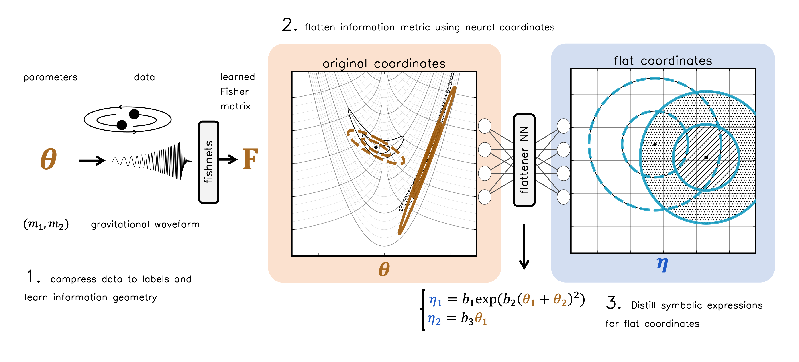

# Degeneracy Distillery

[](https://arxiv.org/abs/2606.23838)
[](https://colab.research.google.com/github/tlmakinen/degeneracy_distillery/blob/main/tutorial_notebooks/rosenbrock_example.ipynb)
[](LICENSE)
[](https://tlmakinen.github.io/blog/2026/degeneracy-distillery/)




<p align="center">
  <a href="https://arxiv.org/abs/2606.23838">
    
  </a>
  &nbsp;
  <a href="https://tlmakinen.github.io/blog/2026/degeneracy-distillery/">
    
  </a>
</p>

A package for mapping information geometry and identifying nonlinear physical coordinates from data and parameters.

---


### Distill in three steps from simulations or labelled data

**Gist:** simulate $(\theta, x)$, learn local Fisher geometry with a network, flatten it, then fit **closed-form** expressions for identifiable vs. degenerate directions.

```python
# Degeneracy Distillery — conceptual API (each block ≈ one main library call)

# Step 1 — learn info geometry with Fisher networks (ensemble)
theta, x = sample_prior_and_simulate(nsims)          # your simulator
W = train_fishnets(theta, x)                         # θ̂ and F(θ|x) per datum

# Step 2 — flatten Fisher geometry (normalizing flow / whitening)
F_ens = predicted_fisher_ensemble(W, x_test)         # shape: (n_models, n, p, p)
eta, J = fit_flattening(F_ens, theta_test, ensemble_weights)  # η, J = ∂η/∂θ

# Step 3 — symbolic regression (+ optional postprocess)
X, y, F_sr = preprocess_for_sr(eta, J, F_ens)      # align / subsample / rotate
exprs = fit_symbolic_regression(X, y, F_sr)          # e.g. PyOperon + MDL
exprs = postprocess(exprs)                           # prune / rotate for sparsity

# exprs → interpretable formulas, e.g. η₂ = θ₂ + θ₁², η₁ = β/γ, …
```

## Features

- Neural network flattening and degeneracy analysis
- Symbolic regression integration with PyOperon
- JAX/Flax-based neural network training
- Preprocessing and postprocessing utilities for network analysis
- Support for various network architectures

## Installation

For detailed installation instructions, see [INSTALL.md](INSTALL.md).

**Quick start:**

```bash
# Clone the repository
git clone https://github.com/tlmakinen/degeneracy_distillery.git
cd degeneracy_distillery

# Create conda environment (use minimal for better compatibility)
conda env create -f degen_env_minimal.yml
conda activate degen

# Install package
pip install -e .

# Install ESR (REQUIRED - must be done separately)
git clone https://github.com/DeaglanBartlett/ESR.git
pip install -e ESR

# Optional: Install Jupyter for local notebook development
pip install -e ".[jupyter]"
```

## Tutorial Notebooks

See the `tutorial_notebooks/` directory for worked examples:

| Notebook | Description |
|---|---|
| [`rosenbrock_example.ipynb`](tutorial_notebooks/rosenbrock_example.ipynb) | Synthetic 2D problem — [START HERE] |
| [`sir_example.ipynb`](tutorial_notebooks/sir_example.ipynb) | SIR epidemiological model |
| [`gw_example.ipynb`](tutorial_notebooks/gw_example.ipynb) | General GW waveform |

### Google Colab

Click the badge above to open the Rosenbrock tutorial in Colab, or install manually:

```python
# 1. Install degeneracy_distillery
!git clone https://github.com/tlmakinen/degeneracy_distillery.git
%cd /content/degeneracy_distillery
!pip install -e .

# 2. Install ESR 
%cd /content
!git clone https://github.com/DeaglanBartlett/ESR.git
%cd /content/ESR
!pip install -e .
```

**Then restart the runtime:** Runtime → Restart runtime

After restarting, verify:
```python
%cd /content/degeneracy_distillery
import degeneracy_distillery
from degeneracy_distillery.sr_utils import fit_and_analyze_sr
print(f"✓ Package version: {degeneracy_distillery.__version__}")
```

## Project Structure

```
degeneracy_distillery/
├── degeneracy_distillery/      # Main source code package
│   ├── training_loop_*.py      # Training loops (Fisher nets + flattening)
│   ├── preprocessing_utils.py  # Fisher geometry preprocessing
│   ├── postprocessing_utils.py # Post-SR analysis and validation
│   ├── sr_utils.py             # Symbolic regression utilities
│   └── visuals/                # Snapshot and animation utilities
├── tutorial_notebooks/         # Polished worked examples (start here)
│   ├── rosenbrock_example.ipynb
│   ├── sir_example.ipynb
│   ├── imrphenomd_example.ipynb
│   └── gw_example.ipynb
├── scripts/                    # Batch sweep scripts
├── tests/                      # Test suite
├── degen_env_minimal.yml       # Conda environment (recommended)
└── INSTALL.md                  # Detailed installation guide
```

## License

MIT License - see [LICENSE](LICENSE) file for details.
