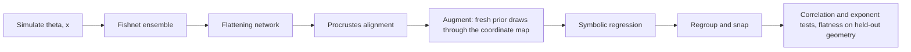

# Intractable-Likelihood Discovery Examples: Cluster Handoff

Companion to [notes/neurips_discovery_reruns.md](neurips_discovery_reruns.md). That
document covers rerunning the *existing* experiments (Rosenbrock, SIR, TaylorF2,
IMRPhenomD, QM7b) across seeds. This one covers three *new* problems built
specifically to answer the reviewer objection that the method needs a tractable
likelihood.

Scripts:

- [scripts/ising_notebook_run.py](../scripts/ising_notebook_run.py)
- [scripts/kolmogorov_notebook_run.py](../scripts/kolmogorov_notebook_run.py)
- [scripts/kuramoto_notebook_run.py](../scripts/kuramoto_notebook_run.py)

A fourth problem — 2D Rayleigh-Bénard convection, a stress-free DNS that adds a
three-parameter case with a weak (nearly degenerate) aspect-ratio direction — is
documented separately in [neurips_rayleigh_benard.md](neurips_rayleigh_benard.md)
([scripts/rayleigh_benard_notebook_run.py](../scripts/rayleigh_benard_notebook_run.py)).
It is validated against the exact linear onset and smoke-tested end to end; the
full runs are not yet done.

## Why these three

Two reviewers asserted that the approach requires a tractable likelihood. Each
of these problems has a likelihood that is unavailable in closed form for a
different and easily stated reason, so the set is hard to dismiss as a single
special case:

- **Ising**: normalised by a partition function `Z(J, T, h)` that cannot be
  computed for a 2D lattice in a field.
- **Kolmogorov flow**: the observable is a functional of a chaotic PDE
  trajectory; no density over it exists in closed form.
- **Kuramoto**: the natural frequencies are latent and redrawn per simulation,
  so even the per-trajectory likelihood would have to be marginalised over `N`
  latent variables and the Brownian paths.

Every one is forward-simulable and nothing else. All three also have a *known*
right answer, which is the point: they are positive controls that show the
discovered coordinates are the textbook ones, on problems where the likelihood
route is closed.

Be explicit in the paper that these recover known physics. The novelty claim
rests on the method finding them without being told, from simulations alone,
at a few-hundred-simulation budget. The IMRPhenomD result remains the place
where the method says something not already in a textbook.

## What each experiment claims

### Ising: `J/T` and `h/T` from raw spin configurations

The Boltzmann weight depends on `theta = (J, T, h)` only through `K = J/T` and
`B = h/T`, so there is an *exact* one-dimensional degeneracy along the scaling
ray `(J, T, h) -> (lam J, lam T, lam h)`. Target: two identifiable coordinates
aligned with `J/T` and `h/T`, plus one nuisance direction.

Observable: 8 decorrelated 16x16 configurations per simulation (2048 raw spins),
no summary statistics.

Two design choices matter. The field is strictly positive so the magnetisation
stays unimodal, which sidesteps the `+m/-m` symmetry breaking that would make
the posterior genuinely multimodal (a documented limitation of the method). And
`J/T` is confined to `[0.125, 0.556]`, straddling the critical coupling 0.4407:
push higher and the magnetisation pins at 1 and stops carrying information
about `h/T`.

### Kolmogorov flow: the Reynolds number from turbulence spectra

Forced 2D Navier-Stokes with `theta = (f0, nu)`. The observable is the
normalised, time-averaged, radially-averaged enstrophy spectrum, so the
amplitude is divided out and by dimensional analysis the observable depends on
the parameters only through

```
Re = f0 / (nu^2 k_f^3),   i.e.   log Re = log f0 - 2 log nu + const.
```

Target: one identifiable coordinate tracking `log Re` and one nuisance
direction. This is the strongest of the three as a headline result because the
answer is a single named dimensionless group and the check is sharp: the fitted
`log nu` / `log f0` exponent ratio must come out at -2.

This supersedes the "Reynolds number discovery" item listed as optional
extra 6 in the rerun plan. That one recovers a dimensionless group from a
prescribed feature set; this one recovers it from a turbulence simulation.

### Kuramoto: the nondimensional ratio basis

`theta = (K, sigma_omega, D)` with latent natural frequencies. Rescaling time
by `sigma_omega` shows the dynamics are controlled by `K/sigma`, `D/sigma` and
an overall clock rate `sigma`, not by the three parameters individually.
Target: the discovered coordinates span that ratio basis.

Unlike the other two there is no exact degeneracy here; all three parameters are
identifiable. The claim is that the method finds the *natural* curved
coordinates rather than a rank deficiency.

## Simulator validation already done

These numbers come from direct probes of the simulators (not the full pipeline)
and are worth rechecking on the cluster if you change any prior. The
identifiability numbers are cross-validated ridge `R^2` from the raw observable
onto each target, which is a pessimistic lower bound on what the Fishnet
ensemble can extract.

Ising:

- Scaling-ray invariance holds numerically: mean magnetisation was 0.6632,
  0.6646, 0.6652, 0.6608 at scale factors 0.6, 1.0, 1.6, 2.4 along a fixed
  `(J/T, h/T)` ray, against a standard error of 0.004. The exact degeneracy is
  real, not approximate.
- Identifiability: `log(J/T)` 0.96, `log(h/T)` 0.77.
- Snapshot count drives the weaker coordinate: `log(h/T)` went 0.55 at 4
  snapshots, 0.65 at 8, 0.73 at 16. Raise `n_snapshots` before anything else if
  the field coordinate is not recovered.

Kolmogorov:

- Prior spans `Re` 25 to 275.
- Identifiability of `log Re`: 0.95.
- Same-Re invariance: three `(f0, nu)` pairs sharing `Re` differ by at most
  0.24 in log spectrum, against a within-group realisation scatter of 0.16,
  while an off-Re control differs by 2.25. Signal beats noise by roughly ten to
  one.
- Resolution: median log occupancy of the cutoff shell is -8.4. If that climbs
  above -5 the dissipation range is unresolved and the grid must grow; the
  script warns automatically.

Kuramoto:

- Identifiability: `log(K/sigma)` 0.85, `log(D/sigma)` 0.62, `log sigma` 0.85.
- The order parameter trace `r(t)` on its own leaves `D` completely
  unidentifiable (`R^2` for `log(D/sigma)` was -0.01). The per-oscillator
  population quantiles in the observable are what fix this, because they expose
  the width of the locked cluster. Do not strip them out to "simplify" the
  observable.

Two simulator details exist for reasons that are not obvious and should not be
tidied away. Kolmogorov runs start from the laminar solution plus a *relative*
perturbation, because spinning up from rest takes `O(Re)` turnover times and
high-Re runs would otherwise never reach steady state. And the spectrum is
averaged over 28 snapshots, because a single snapshot is dominated by
realisation noise and gives an almost uninformative Fisher.

The Ising encoder is likewise deliberate. `SnapshotEncoder` convolves each
configuration with circular padding, pools over space, then pools over
snapshots, which is exactly permutation invariant across snapshots and
translation invariant on the lattice (both verified to float32 roundoff). It has
20k parameters against roughly 524k for a dense encoder on the same 2048 raw
spins, and the dense version overfits within 200 epochs at these budgets.

## Smoke-run results

All three have been run end to end at `--mode smoke` on CPU. Every stage
completed and all artifacts were written. These budgets are far below the full
configuration, so treat the numbers as evidence the plumbing works, not as
results.

Kuramoto, 200 simulations, 4 fishnets, 45 s of SR per component: recovered
`log sigma` at cosine 0.98 and `log(K/sigma)` at 0.82, with `log(D/sigma)` the
laggard at 0.53. Held-out flatness was 0.82 for the discovered expressions
against 1.15 for the raw parameters and 1.16 for the ad-hoc ratio basis. Worth
noting for the paper: the textbook nondimensionalisation barely improves on the
raw parameters, while the learned coordinates clearly do.

Kolmogorov, 100 simulations, 32^2 grid: the neural coordinate map reached a
flatness of 0.19 against 0.99 for the raw parameters, so the flattening stage
works well. But symbolic regression did not capture it (1.59, worse than raw),
returned near-linear expressions, and the fitted exponent came out at -0.93
rather than -2.

Ising, 200 simulations, 12^2 lattice, 4 snapshots: recovered `J/T` at
correlation 0.95 and `h/T` at 0.60, matching the prediction from the ridge probe
that the field coordinate is the weak one at low snapshot counts. Full mode uses
8 snapshots on a 16^2 lattice, which the probe puts nearer 0.65 to 0.73. Neural
flatness was 0.92 against 1.35 for the raw parameters and 1.69 for the ad-hoc
reduced coordinates; symbolic regression landed at 1.31, barely better than
doing nothing. Note also the runtime split: 5997 s of the 6171 s total went to
the fishnet ensemble, entirely because convolutions are slow on CPU. This
disappears on a GPU.

**Symbolic regression, not the geometry, is the bottleneck — and this is now the
pattern in two of the three problems.** In both Kolmogorov and Ising the
flattening network found a good coordinate map and SR failed to express it. If
the full runs repeat this, escalate `--sr-time-limit` before touching anything
else.

One incidental finding worth keeping for the paper: in both Ising and Kuramoto
the ad-hoc textbook reduction is *worse* than the raw parameters (1.69 vs 1.35,
and 1.16 vs 1.15). Writing down the standard dimensionless groups by hand does
not flatten the Fisher geometry; the learned coordinates do.

## Pipeline structure

All three follow the same stages as the existing `*_notebook_run.py` scripts:



The augmentation step is the simulation-efficiency argument for the rebuttal:
it draws 2000 fresh parameter points and pushes them through the *already
trained* coordinate ensemble. These are network evaluations and cost **zero**
additional simulator calls. Each run records both counts separately in
`run_summary.json`.

Every run takes a single `--master-seed` and expands it into per-stage seeds
(simulator, network init, training, flattening, alignment, SR grid, SR search)
via `np.random.SeedSequence`, so a trial is reproducible from one integer and
independent trials are genuinely independent.

### Parameter scaling

All three scripts scale theta to **[1, 2]** before the fishnet stage, via
`fit_theta_scaler(theta_train, feature_range=(1.0, 2.0))`. This is the same
convention as `gw_notebook_run.py` and `imrphenomd_notebook_run.py`. Rosenbrock
is the deliberate exception at `(-3, 3)`, because that problem is symmetric
about the origin and wants signed coordinates.

The [1, 2] choice matters for these three specifically, because every target
expression is a ratio or a log: `J/T`, `h/T`, `f0 L^3 / nu^2`, `K/sigma`,
`D/sigma`. Keeping the scaled inputs strictly positive and of order unity means
symbolic regression can form quotients and logs without a zero in the
denominator or the argument.

Verified end to end on the smoke artifacts rather than assumed: the scaled
theta that reaches symbolic regression spans **[0.977, 2.002]** across all
three problems, minimum absolute value 0.977. The excursion just below 1 is
expected and harmless — the scaler is fit on the training split and applied to
the test split, so the test extremes overshoot slightly. Nothing approaches
zero.

Two things follow, and both are already correct in the scripts. Nothing between
the fishnet stage and symbolic regression shifts the range, which is why
`expressions_to_physical(..., sr_offset=0.0)` is the right call: some reference
notebooks apply a `+1` shift to keep PyOperon inputs positive after alignment,
and passing a nonzero `sr_offset` here would silently bias every physical
expression. And `fit_flattening`'s internal `minmax_scale_inputs=True` rescales
only within the flattening network; it does not propagate to the SR inputs.

If you add a fourth problem, keep `(1.0, 2.0)` unless the parameters genuinely
need to be signed.

## How to run

Smoke first, on one node, to confirm the environment:

```bash
python scripts/ising_notebook_run.py       --mode smoke --master-seed 0 --out-dir /tmp/smoke/ising
python scripts/kolmogorov_notebook_run.py  --mode smoke --master-seed 0 --out-dir /tmp/smoke/kolmogorov
python scripts/kuramoto_notebook_run.py    --mode smoke --master-seed 0 --out-dir /tmp/smoke/kuramoto
```

Smoke mode uses small budgets and will often miss the recovery thresholds. Pass
`--min-identifiable-corr 0` (Ising), `--min-reynolds-corr 0 --max-exponent-error 99`
(Kolmogorov) or `--min-ratio-corr 0 --min-ratio-cosine 0` (Kuramoto) so a smoke
run exercises the whole pipeline instead of exiting at the gate.

Three overrides exist so the common escalations do not need a code edit:
`--sr-time-limit` on all three, `--n-snapshots` on Ising, and `--grid` on
Kolmogorov.

Then the seed campaign, one job per seed, all independent:

```bash
for seed in 0 1 2 3 4 5 6 7 8 9; do
  python scripts/ising_notebook_run.py --mode full --master-seed $seed \
      --out-dir results/rebuttal_discovery/ising/seed_$seed
done
```

Same pattern for the other two. Ten seeds each. Add `--no-require-gpu` only if
you deliberately intend a CPU run; the default hard-fails when JAX has no GPU,
which is what you want on a cluster where a silent CPU fallback would waste
hours.

## Compute

Measured on 8 CPU cores at 64^2: the Kolmogorov solver runs about 5000
simulation-steps per second. A full run is 1000 simulations at 9100 steps, so
roughly 30 to 45 minutes of pure solver time on CPU and a few minutes on an
A100 once the batch is on device. It is the most expensive of the three; use
`--sim-chunk` to trade memory against throughput.

Ising and Kuramoto simulation are cheap. For all three the fishnet and
flattening stages dominate wall clock, and symbolic regression is bounded by
`sr_time_limit` (300 s per component in full mode).

Budget one GPU per seed. Thirty jobs total across the three problems.

## Outputs and what to aggregate

Each run writes `run_summary.json` in its output directory:

- `counts`: training simulations, evaluation simulations, and augmented
  coordinate evaluations, kept separate so the simulation-efficiency claim can
  be stated precisely.
- `discovery`: the physical expressions, the correlation and exponent
  diagnostics, and a boolean `success`.
- `heldout_geometry`: median Frobenius distance from the identity for the raw
  parameters, an ad-hoc textbook baseline, the MDL expressions, the pruned
  expressions, and the neural map. The ad-hoc baseline is the honest
  comparison: it is what a domain expert would write down by hand.
- `runtime_seconds` per stage.

Also written: `sr_results_*/sr_expressions.pkl` with the full expression set and
analysis, a zipped copy of the SR directory, and an input-summary figure worth
eyeballing before trusting any run.

For the rebuttal table, aggregate `discovery.success` across seeds per problem
and quote the recovery rate, plus the median of the relevant diagnostic. The
sentence to aim for:

> Across 10 independent trials on three problems with no tractable likelihood
> (2D Ising, forced 2D turbulence, noisy Kuramoto), each using 500 training
> simulations, the method recovered the known governing coordinates in X/10,
> Y/10 and Z/10 runs respectively.

## Risks and knobs

- **A run fails the gate.** The thresholds are deliberately strict. Check the
  input-summary figure and the ridge-probe numbers above before concluding the
  method failed; an uninformative observable looks the same as a bad run in the
  summary JSON.
- **Ising field coordinate is the weak one.** Raise `n_snapshots` (8 to 16) and
  re-check. This costs Metropolis sweeps, nothing else.
- **Kolmogorov spectra look flat or the cutoff-shell warning fires.** Raise
  `grid` to 128 and lower the top of the `Re` prior. Do not raise `cfl`.
- **`flatten_batch_size` must divide `nsims`.** Otherwise the flattener silently
  drops samples, and if the batch exceeds the sample count it drops all of them
  and crashes inside the norm-factor computation.
- **Symbolic regression is the most likely failure point**, seen in two of three
  smoke runs: the flattening network found a good coordinate map and SR failed
  to express it. Compare `heldout_geometry.nn` against `heldout_geometry.pruned`
  in the summary JSON. If `nn` is small and `pruned` is not, the geometry is
  fine and the SR budget is the problem.
- **The scripts have not been run end to end at `--mode full`.** The simulators
  and the stage APIs are verified and smoke mode exercises every stage, but full
  budgets and the recovery thresholds themselves are untested. Run one full seed
  per problem and inspect it before launching all thirty.
