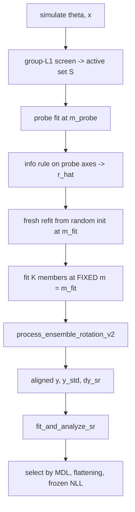

# One-step sweep pipeline

This note is the durable copy of the one-step sweep. The driver is
`scripts/oneshot_sweep.py`. Adapters live in
`degeneracy_distillery/problems/`. This note does not replace
`notes/heater_oneshot_scaling.md`. That file still documents the
heater-only script.

## Pipeline



The screen names the active coordinates. It does not choose the rank,
and it does not remove any coordinate from later steps.

The rank comes from the probe. `--rank-rule info` (the default) scores
each probe axis on held-out data as
`0.5 log(prior var of eta_j / var of (eta_j - eta_hat_j(x)))` and counts
the axes above `--info-floor` (0.5 nats), capped at `d`. Uninformed axes
score 0 plus sampling error; over the Rosenbrock grid the largest was
0.23, and a 1-nat floor missed the real second axis at `d=32` (0.66-1.25
nats). That is the one-step loss of the
axis against a model that sees no data, so it does not depend on the
units of theta. `--rank-rule nll` keeps the old descent, which drops
axes while held-out NLL does not rise; that compares densities over
different numbers of axes, and on Rosenbrock's `[-3, 3]` box it drops
informative axes.

The probe is only a discovery device. The production map is a new
network trained from random init with `m = m0 = m_fit`, where `m_fit` is
`r_hat`, or `r_hat + 1` when the probe latent spectrum falls by less
than `--rank-min-gap` between axes `r_hat` and `r_hat + 1`. Every
ensemble member then trains at that fixed `m_fit`.

The symbolic-regression rows are the aligned test points plus prior
draws. The prior draws go through `apply_ensemble_alignment`, so they get
the same centring, rotation, reference mean and floor shift as the
aligned rows.
A per-member ladder would give members different `m`, and
`process_ensemble_rotation_v2` needs one `m` to stack `eta_ensemble` as
`(K, n, m)`.

Each member still reports `jtj_eigengap` on its Jacobian. That cost is
an eigendecomposition of `J^T J`. It needs no extra fit.
`jtj_rank_agreement_k` counts members whose eigengap rank matches
`r_hat`.

The driver writes three selected expressions:

- `expression_mdl`, at `argmin(DL)`
- `frob_coordinates`, at `argmin(frobloss)`
- `expression`, the frozen pick

The frozen pick re-inserts the top Pareto stacks into the one-step
loss as `coord_fn` and scores held-out NLL. That number is in nats.
Record `picks_agree` when the frozen pick equals the MDL pick.

## Problem protocol

`degeneracy_distillery/problems/base.py` defines the adapter surface.
The driver owns the loop. The adapter owns only the parts that change
between simulators.

| Field or method | What it controls | How the copies differ |
| --- | --- | --- |
| `name`, `d`, `param_names` | Metrics key and ambient size | Rosenbrock sweeps `d`. RB is 3 or 8. |
| `theta_lo`, `theta_hi` | Flattener min-max scale | Rosenbrock is `[-3, 3]`. RB-8 is 1.5 decades around a reference. |
| `use_log_features` | Concatenate `log(theta)` | False on Rosenbrock and RB-3. True on RB-8. |
| `m_probe`, `expected_rank` | Ladder start and the rank gate | Rosenbrock uses 4 and 2. RB uses 5 and 3. |
| `sample(n, rng)` | Draw `(theta, x)` | Rosenbrock is a banana plus noise. RB calls the DNS. |
| `sample_prior(n, rng)` | Prior draws for SR | Rosenbrock is a uniform box. RB-8 uses `PiSystem`. |
| `estimator_factory(m)` | `eta_psi` flax module | Rosenbrock mean-pools replicates. RB reads a flat spectrum. |
| `truth_coords(theta)` | Closed-form `R^2` target | Banana pair, or the three Pi groups. |
| `gates(payload)` | Pass or fail checks | Screen pair, or Nusselt and Pi leakage. |
| `sr_hints()` | Operon symbols and size | Polynomial for Rosenbrock. Log and exp for RB. |

Dataset-backed problems such as CAMELS, QM7b, and weak lensing have no
simulator and no box prior. `sample_prior` must then draw from the
empirical parameter measure. The volume term in `train_oneshot` still
averages `log det JJ^T` over the training pairs. It does not redraw
from the prior. That is a known limit of the current loss.

## Add an adapter

The smallest adapter is Rosenbrock. Copy
`degeneracy_distillery/problems/rosenbrock.py` and change six things.

1. Set `d`, `param_names`, `theta_lo`, `theta_hi`, and `use_log_features`.
2. Write `sample` so it returns `(theta, x)`.
3. Write `sample_prior` so it returns prior `theta` only.
4. Write `estimator_factory(m)` so it matches the shape of one `x` row.
5. Write `truth_coords` if a closed form exists. Return `None` if not.
6. Write `gates` and `sr_hints`.

Register the class in `degeneracy_distillery/problems/base.py` inside
`_load_builtin`. Then run

```
python scripts/oneshot_sweep.py --problem your_name --num-trials 1 --quick
```

A three-step comparison arm is optional. Add `threestep_arm` on the
adapter. The driver calls it only for `--arms threestep` and only when
`d <= 16`.

## Launch recipes

Rosenbrock scaling, 2 arms, 5 dims, 10 trials:

```
PROBLEM=rosenbrock sbatch --array=0-99 scripts/slurm/oneshot_sweep_gpu.sh
```

The array index is

```
TASK = ARM_IDX * (N_DIMS * N_TRIALS) + DIM_IDX * N_TRIALS + TRIAL
```

Default arms are `oneshot threestep`. Default dims are `2 4 8 16 32`.
A three-step task at `d > 16` writes `status=skipped_by_budget`.

RB nondimensional gate, one seed, smoke budget:

```
MODE=smoke N_PARAMS=3 sbatch --array=0 scripts/slurm/rb_raw_units_gpu.sh
```

RB raw units, 10 seeds, full budget:

```
MODE=full N_PARAMS=8 sbatch --array=0-9 scripts/slurm/rb_raw_units_gpu.sh
```

Do not launch `n_params=8` until `n_params=3` clears the Nusselt
correlation and gradient-cosine thresholds. Both default to 0.9.

Plot any sweep that writes the shared `metrics.csv` schema:

```
python scripts/plot_oneshot_scaling.py --in-dir $OUT_BASE --out-dir $OUT_BASE
```

## Next adapters

These simulators already exist. Each can be a new adapter. None of
them needs a new driver.

| Problem | `d` | Rank | Simulator |
| --- | --- | --- | --- |
| Kolmogorov | 2 | 2 | `scripts/kolmogorov_notebook_run.py` |
| Ising | 2 | 2 | `scripts/ising_notebook_run.py` |
| Kuramoto | 3 | 2 | `scripts/kuramoto_notebook_run.py` |
| Enzyme | 4 | 2 | heater-family scripts |
| SIR | 3 | 2 | `scripts/sir_discovery_3d_rerun.py` |
| GW TaylorF2 | 4 | 2 | `new_idea/gw_oneshot.py` |
| GW extrinsics | 8 | 2 | `new_idea/gw_detection_extrinsics.py` |
